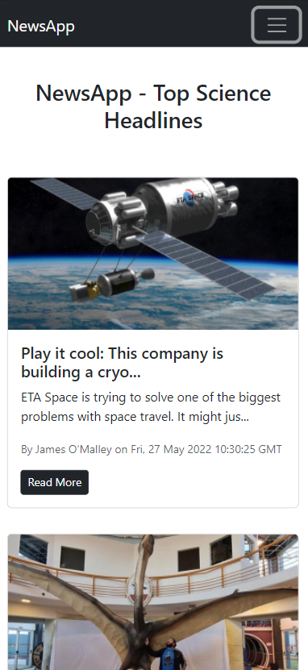

# News App - Read News Daily!

This project was bootstrapped with [Create React App](https://github.com/facebook/create-react-app). In this app we have used the [NEWS API](https://newsapi.org/) to display the data. The project is created using "Class Based Compenents".

## Clone the repo

 `git clone https://github.com/sakshijain009/newsapp.git`
 
## Install Dependencies

`npm i`

## Start the app

`npm start`

Runs the app in the development mode.\
Open [http://localhost:3000](http://localhost:3000) to view it in your browser.

## Preview of the app

## Phone View

  
  

